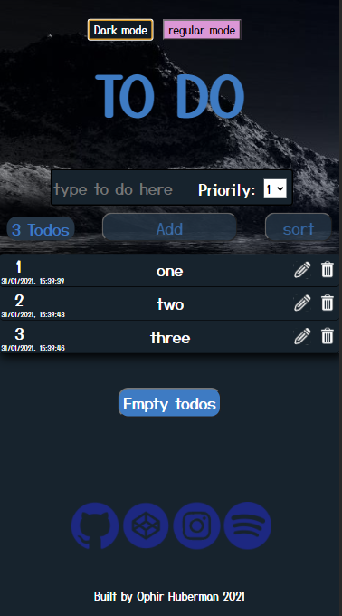

<h1>Pre Course Project - Todo List</h1>

## by Ophir Huberman, Github page: https://hubermanophir.github.io/pre-course-2021-final-boilerplate/src/index
 

# Main features 

1. You can add to do items, they will be added at the end of the list.
2. To do can be set with a priority ranging from 1-5.
3. You have the number of current todos to the left of the add button.
4. To do items can be sorted using the sort button, items will be sorted from the highest priority to the lowest.
5. List items are persistent using jsonbin.io to save the current list. The same list is loaded when the page is refreshed. You will get notified in the console whether adding a certain to do item was successful or not.

# extra features

1. Delete button next to each list item : 

After you clicked on the delete button you will need to confirm your delete action.

2. Edit button next to each list item:

Once you click on the edit button the text inside the item can be changed, just *double click* the text and change it. Upon clicking the pencil icon will be changed to a check mark just like so :

By clicking the check mark you will confirm your edit. The list will then be updated in jsonbin.io and the local storage.

3. Empty todos : Once clicked the list will be emptied.

4. Dark mode: On the upper right of the screen you can see the selection between the regular mode which is shown above and the dark mode which can be easier on your eyes :) it looks like so :

5. Used media query in css to make the website more compatible with phones : 

6. On the left side you can see the links to my social accounts : instagram, github, codepan and my daily spotify mix, highly recommended.

 

## sources 

- youtube of course and especially this guy: https://www.youtube.com/channel/UCvjgXvBlbQiydffZU7m1_aw
- https://www.w3schools.com/ 
- https://developer.mozilla.org/en-US/
- https://www.javascripttutorial.net/
- https://stackoverflow.com/
